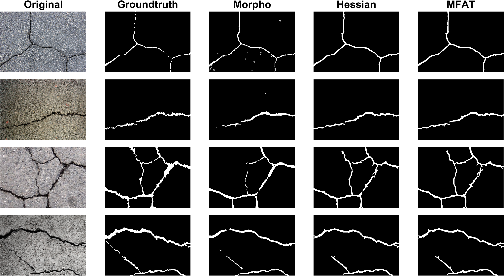

# Introduction

This repository consists of classical cracks semantic segmentation methods such as morphological, Hessian and Fractional Anisotropic Tensor MATLAB codes that are tailored for the cracks on concrete and pavement surfaces.

# Quick Pipeline Visualization
## Example: Segmentation methods
| Images after the segmentation |
| ------------- |
|  |

# Requirements
MATLAB  
MATLAB Image Processing Toolbox

# Feedback
Please rate and provide feedback for the further improvements.
