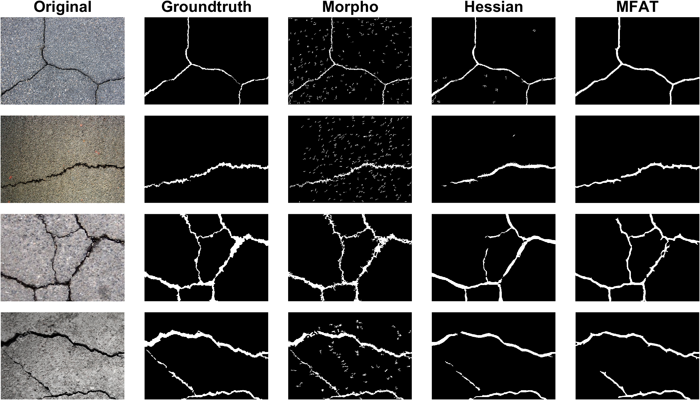

# Introduction
[](https://www.mathworks.com/matlabcentral/fileexchange/178519-cracks-segmentation-by-gradient-and-morphological-methods) [](https://matlab.mathworks.com/open/github/v1?repo=preethamam/Cracks-Segmentation-Methods-Gradient-Morphological)

Cracks are the defects formed by cyclic loading, fatigue, shrinkage, creep, and so on. In addition, they represent the deterioration of the structures over some time. Therefore, it is essential to detect and classify them according to the condition grade at the early stages to prevent the collapse of structures. Cracks can be segmented using the classical semantic segmentation methods such as morphological, Hessian and Multiscale Fractional Anisotropic Tensor that are widely used in medical imaging community. In this repository, these programs developed and/or improved are fine-tuned for cracks segmentation and are presented through some use case examples that are tailored for the cracks on concrete and pavement surfaces.

# Quick Pipeline Visualization
## Example: Segmentation methods
| Images after the segmentation |
| ------------- |
|  |

# Citation
## Original articles
[1]. Salembier, P.: Comparison of some morphological segmentation algorithms based on contrast enhancement. Application to automatic defect detection. In: Proceedings of the EUSIPCO-90—Fifth European Signal Processing Conference, pp. 833–836 (1990). <br />
[2]. Jahanshahi, Mohammad R., Sami F. Masri, Curtis W. Padgett, and Gaurav S. Sukhatme. "An innovative methodology for detection and quantification of cracks through incorporation of depth perception." Machine vision and applications 24 (2013): 227-241. <br />
[3]. Frangi, A.F., Niessen, W.J., Vincken, K.L., Viergever, M.A. (1998). Multiscale vessel enhancement filtering. In: Wells, W.M., Colchester, A., Delp, S. (eds) Medical Image Computing and Computer-Assisted Intervention — MICCAI’98. MICCAI 1998. Lecture Notes in Computer Science, vol 1496. Springer, Berlin, Heidelberg. https://doi.org/10.1007/BFb0056195. <br />
[4]. Alhasson, Haifa F., Shuaa S. Alharbi, and Boguslaw Obara. "2D and 3D vascular structures enhancement via multiscale fractional anisotropy tensor." In Proceedings of the European conference on computer vision (ECCV) workshops, pp. 0-0. 2018.

Sample images are used from the article: <br />
[5]. Liu, Yahui, Jian Yao, Xiaohu Lu, Renping Xie, and Li Li. "DeepCrack: A deep hierarchical feature learning architecture for crack segmentation." Neurocomputing 338 (2019): 139-153.

All cracks semantic segmentation methods tailored and fine-tuned are available to the public. If you use any of these programs in your research, please cite the above works.

## Original code repositories
[1]. [MATLAB File Exchange: Hessian based Frangi Vesselness filter](https://www.mathworks.com/matlabcentral/fileexchange/24409-hessian-based-frangi-vesselness-filter) <br />
[2]. [GitHub Repo: MFAT](https://github.com/Haifafh/MFAT)

## Fine-tuned version
The fine-tuned versions of Hessian (Frangi) and Multiscale Fractional Anisotropic Tensor based on the Gaussian kernel sigmas for the cracks segmentation methods are also available to the public. Please use the following BibTeX entry to cite when used in your research:
```bibtex
@PhdThesis{preetham2021vision,
author = {{Aghalaya Manjunatha}, Preetham},
title = {Vision-Based and Data-Driven Analytical and Experimental Studies into Condition Assessment and Change Detection of Evolving Civil, Mechanical and Aerospace Infrastructures},
school =  {University of Southern California},
year = 2021,
type = {Dissertations & Theses},
address = {3550 Trousdale Parkway Los Angeles, CA 90089},
month = {December},
note = {Condition assessment, Crack localization, Crack change detection, Synthetic crack generation, Sewer pipe condition assessment, Mechanical systems defect detection and quantification}
}
```

# Requirements
MATLAB <br />
MATLAB Image Processing Toolbox

# Feedback
Please rate and provide feedback for the further improvements.
